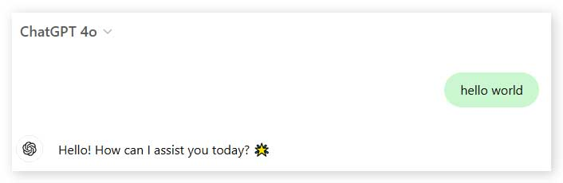

# Custom-CSS-Snippets 
This is a compilation of my CSS alterations of well known websites (or not).

I recommend using it alongside a extension like "Custom CSS by Denis", available at the Chrome Extension Webstore: https://chromewebstore.google.com/detail/custom-css-by-denis/cemphncflepgmgfhcdegkbkekifodacd

## Snippet 1 - Coloured Chat GPT User Messages

This CSS changes the backgound color of the user sent messages to a low saturated bright green, helping to distinguish between user messages and chat GPT's response.

    
 Image Preview

  

## Snippet 1.1 - Coloured Chat GPT Plus

This CSS expands the modifications from the first snippet, adding a couple more changes:

- User messages
- User input area
- ChatGPT messages
- ChatGPT code container background

    
 Image Preview

  

